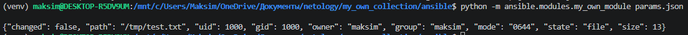
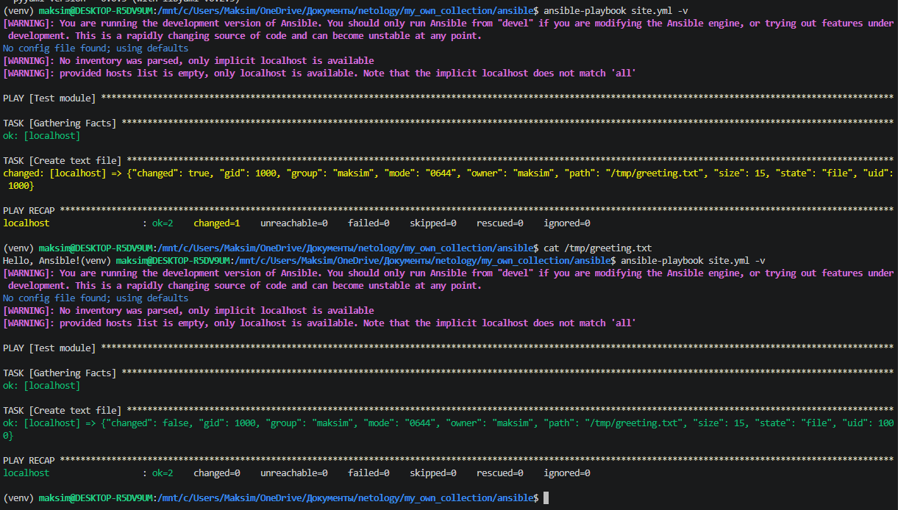
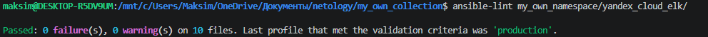
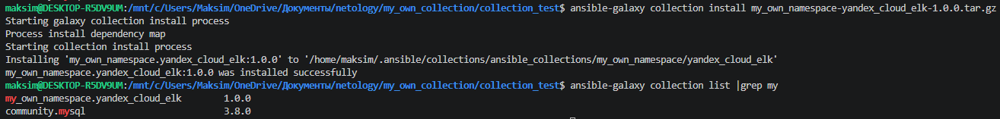
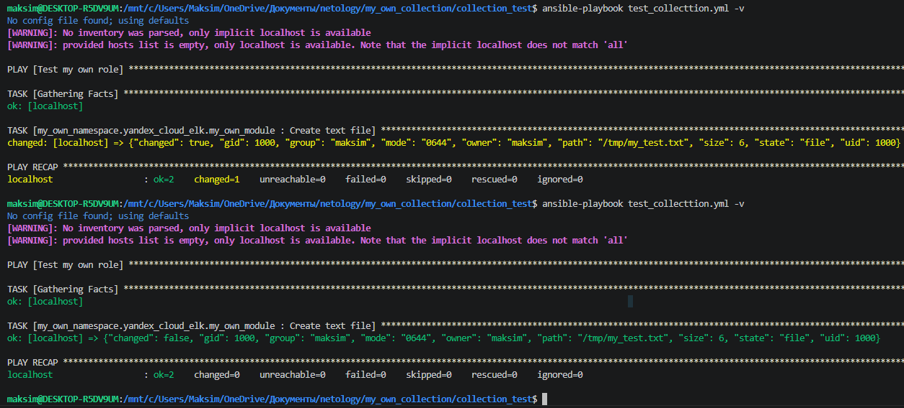

# Домашнее задание к занятию 6 «Создание собственных модулей»

| | |
|-----|-----|
| params.json | параметры для локального теста|
| site.yml | playbook для теста модуля |
| yandex_cloud_elk/ | папка с коллекцией|
| collection_test/ | папка для теста коллекции |
| test_collecttion.yml | playbook для использования role |
| my_own_module.py | модуль |

1. Проверка на исполняемость локально

2. Проверьте через playbook на идемпотентность.

3. Проверка синтаксиса

4. Установка collection из локального архива

5. Запуск playbook и проверка на идемпотентность

